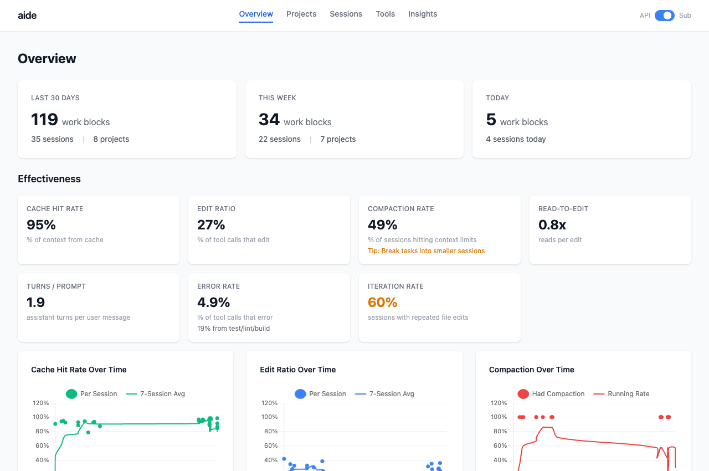
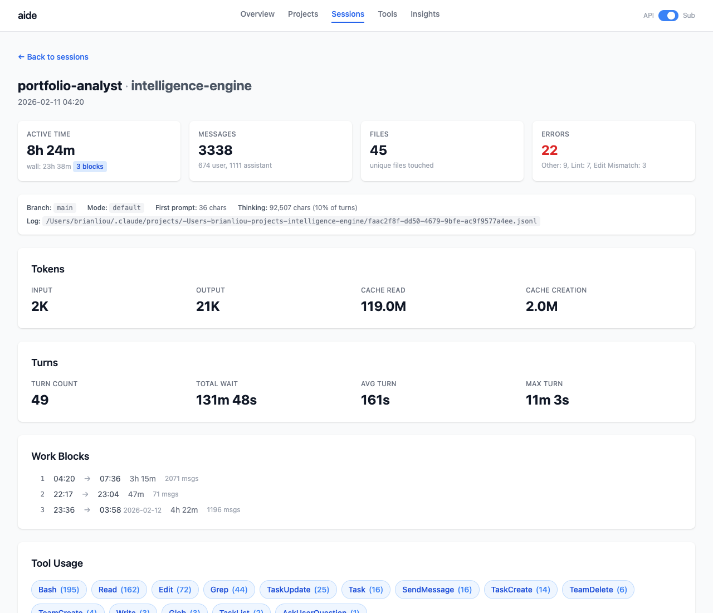
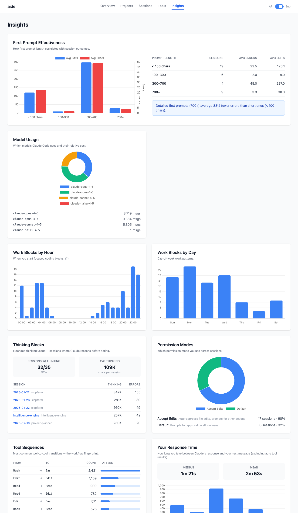

# aide

> AI Developer Effectiveness tool. Track your AI coding productivity across all projects.

aide ingests your Claude Code session logs and tells you what's happening: cost trends, token usage, session patterns, efficiency metrics, and actionable recommendations for improving your CLAUDE.md. The "Fitbit for AI coding."

## Why

The [METR study](https://metr.org/blog/2025-07-10-early-2025-ai-experienced-os-dev-study/) found developers believe AI makes them 20% faster but were actually 19% slower. Without data, you're guessing. aide gives you the data.

## Screenshots







## Quick Start

```bash
pip install aide-dashboard    # or: git clone + uv sync
aide ingest                   # Parse your Claude Code logs into SQLite
aide serve                    # Open the dashboard at localhost:8787
aide autopsy <session-id>     # Diagnose a specific session
```

## What You Get

```
~/.claude/projects/**/*.jsonl → parser → SQLite → aide
```

aide reads Claude Code's local session logs (JSONL), parses them into a SQLite database, and provides multiple ways to analyze them:

- **Dashboard** (`aide serve`) — Web UI showing cost trends, session browser, project comparisons, and tool usage patterns across all your sessions
- **Session diagnostics** (`aide autopsy <id>`) — Per-session Markdown report with cost breakdown by category, context window analysis, compaction detection, and CLAUDE.md improvement suggestions
- **Quick stats** (`aide stats`) — Terminal summary of sessions, costs, and projects

Zero LLM calls. Zero cost to run. All data stays local.

## Commands

```bash
aide ingest              # Parse new/changed logs
aide ingest --full       # Rebuild database from scratch
aide serve               # Start dashboard at localhost:8787
aide serve --port 9000   # Custom port
aide stats               # Print summary to terminal
aide autopsy <id>        # Diagnose a specific session
```

## Configuration

Optional config at `~/.config/aide/config.yaml`:

```yaml
# Set to true if you're on Claude Pro/Max subscription
# Costs will show as "estimated equivalent at API rates"
subscription_user: false
```

## Data Privacy

All data stays on your machine. No telemetry, no cloud, no accounts. aide reads local log files and stores results in a local SQLite database.

## Development

```bash
git clone https://github.com/brianhliou/aide.git
cd aide
uv sync          # Install dependencies
uv run pytest    # Run tests (357 tests)
uv run aide serve   # Start dev server
```

## License

MIT
