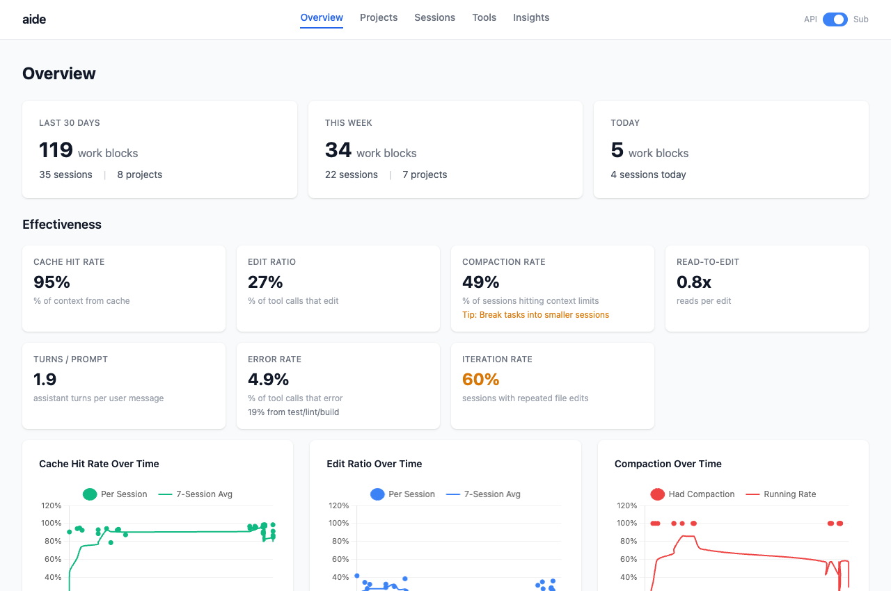
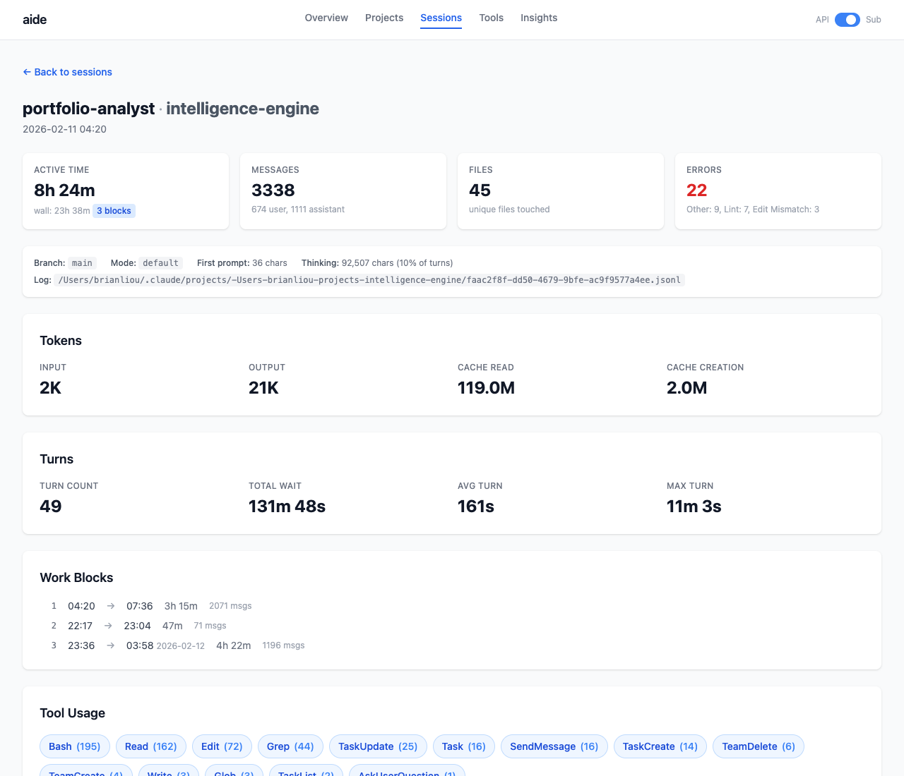
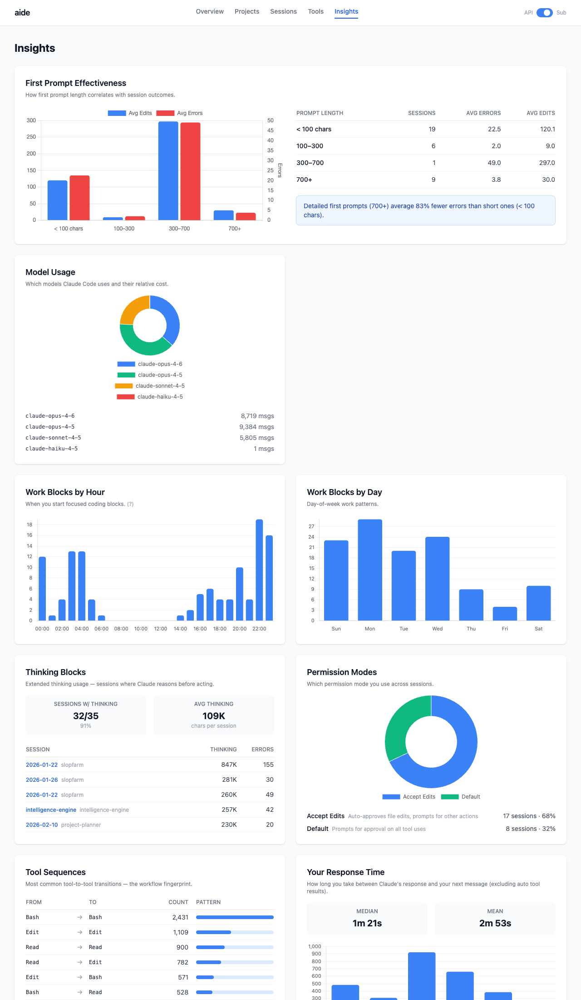

# aide

> Local AI developer-effectiveness for Claude Code, Codex, and the projects they touch.

aide turns local AI coding session logs into a practical feedback loop: ingest sessions, understand cost and token behavior, diagnose where work went sideways, and preserve useful project knowledge as reviewable artifacts, runbooks, and start-session briefs.

The product stays local-first and zero-LLM-call by default. Claude Code and Codex are the first supported providers, normalized into one SQLite database and one dashboard instead of separate tool silos.

## Why

The [METR study](https://metr.org/blog/2025-07-10-early-2025-ai-experienced-os-dev-study/) found developers believe AI makes them 20% faster but were actually 19% slower. Without data, you're guessing. aide gives you the data.

## Screenshots







## Quick Start

```bash
pip install aide-dashboard    # or: git clone + uv sync
aide ingest                   # Parse configured local AI coding logs
aide ingest --provider codex  # Parse only Codex logs
aide serve                    # Open the dashboard at localhost:8787
aide autopsy <session-id>     # Diagnose a specific session
```

## What You Get

```
~/.claude/projects/**/*.jsonl → Claude parser → SQLite → aide
~/.codex/sessions/**/*.jsonl  → Codex parser  → SQLite → aide
```

aide reads local AI coding session logs (JSONL), parses them into a SQLite database, and provides multiple ways to analyze and reuse what happened:

- **Dashboard** (`aide serve`) — Web UI showing cost trends, session browser, project comparisons, and tool usage patterns across all your sessions
- **Data freshness** — Overview panel showing Claude/Codex session counts, latest session timestamps, tracked file counts, and last ingest timestamps
- **Effectiveness overview** — Project/provider rollups for cost per session, active time, review queue rate, edit attribution, and error trends
- **Session diagnostics** (`aide autopsy <id>`) — Per-session Markdown report with cost breakdown by category, context-window analysis, compaction detection, and project-instruction improvement suggestions
- **Investigation queue** — Dashboard view that flags sessions with weak attribution, high friction, file-access failures, no-edit expensive work, and other review signals
- **Semantic artifacts** — Reviewable project knowledge proposed from sessions and accepted before becoming durable context
- **Runbooks and briefs** — Markdown generated from accepted artifacts for future human or agent sessions
- **Quick stats** (`aide stats`) — Terminal summary of sessions, costs, and projects

Zero LLM calls. Zero cost to run. All data stays local.

## Commands

```bash
aide ingest              # Parse configured sources
aide ingest --provider claude
aide ingest --provider codex
aide ingest --full       # Rebuild database from scratch
aide ingest --archive-raw  # Also copy raw logs locally (sensitive; off by default)
aide backup-redacted     # Write redacted log backups for configured sources
aide redact-audit --strict  # Check redacted backups for likely sensitive leftovers
aide jobs status         # Check launchd ingest/backup health
aide serve               # Start dashboard at localhost:8787
aide serve --port 9000   # Custom port
aide stats               # Print summary to terminal
aide autopsy <id>        # Diagnose a specific session
aide digest <id> --save-proposals
aide artifacts list
aide artifacts show <artifact-id>
aide artifacts accept <artifact-id>
aide artifacts reject <artifact-id>
aide runbook generate --project <name>
aide brief --project <name> --task "<task>"
```

## Configuration

Optional config at `~/.config/aide/config.yaml`:

```yaml
# Set to true if you're on Claude Pro/Max subscription
# Costs will show as "estimated equivalent at API rates"
subscription_user: false

# Optional: configure multiple providers. If omitted, aide uses
# log_dir as a legacy Claude source.
sources:
  - provider: claude
    path: ~/.claude/projects
  - provider: codex
    path: ~/.codex/sessions
```

## Data Privacy

All data stays on your machine. No telemetry, no cloud, no accounts. aide reads local log files and stores derived results in a local SQLite database. Raw log archiving is off by default because logs can contain prompts, file paths, tool output, and secrets.

For routine backups, prefer redacted copies:

```bash
aide backup-redacted --out ~/.local/share/aide/redacted-logs
aide redact-audit ~/.local/share/aide/redacted-logs --strict
```

This uses configured `sources`, writes provider-separated output, and prints counts
only. `redact-audit` reports finding categories and JSON field paths only; it does
not print matched log values.

## Development

```bash
git clone https://github.com/brianhliou/aide.git
cd aide
uv sync          # Install dependencies
uv run pytest    # Run tests (569 tests)
uv run aide serve   # Start dev server
```

## License

MIT
